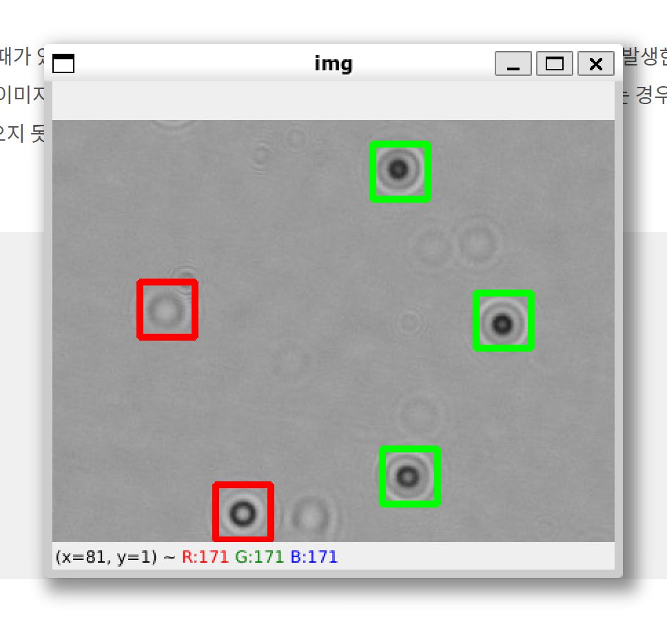

# 02-YOLOX 모델 학습
> 22-04-19

## 개요  

Object Detection 모델을 YOLOX로 선정하여 Cell Count를 학습한다. 그 전에 labeling 값을 Detection 모델에서 사용할 수 있도록 변환한다.

## Detection visualizing  

후에 안드로이드 상에서 검출한 Cell Count에 대해서 시각화를 하고싶다는 요청이 들어왔다.  
Detection을 한 결과를 이용해 cv2 상에서 시각화 하는 편이 빠를 것같아서 관련 로직을 작성했다.  

LiveOrDead Column을 참고해 1일경우 green 색상으로, 0일경우 red 생상으로 시각화를 진행했다.  



## csv to json

YOLOX는 labelme의 json 파일 형식을 지원한다고 하여 labelme의 json 형식 대로 csv를 변환하기로 했다.  

ex)
``` json
{
    "version": "4.0.0",
    "flags": {},
    "shapes": [
        {
            "label": "live",
            "points": [
                [
                    191,
                    107
                ],
                [
                    313,
                    329
                ]
            ],
            "group_id": null,
            "shape_type": "rectangle",
            "flags": {}
        }
    ],
    "imagePath": "k0-0_0_0.jpg",
    "imageData":null,
    "imageHeight": 306,
    "imageWidth": 408
}
```  

json으로 변환하는 프로그램은 제작할 때 padas로 하는 방식 등 여러가지를 고려해 봤으나 Dictionaly 형태로 직접 만들어서 넣는 방식이 가장 간편했다.  

중간에 막혔던 부분이 csv에서 json으로 값을 전달할 때, csv의 정수형이 ```<numpy.int64>```였기 때문에 json에서 지원하는 기본 ```<int>``` 형태로 변환해 줘야 했다.  


## csv to json -> fix

위와 같이 제작한 json파일로 YOLOX를 실행하려 했는데 한가지 문제가 생겼다.  

YOLOX는 COCO format과 VOC format만 지원하기 때문에 json 파일을 하나로 통합하고 수정해줘야 했다.  

VOC format은 xml로 만들어야 하기 때문에 COCO format을 사용하기로 했다.  

```json
{
    "info": {},
    "licenses": [],
    "categories":[
        {
            "id": 1,
            "name": "live",
            "supercategory": "cell"
        },
        {
            "id": 2,
            "name": "dead",
            "supercategory": "cell"
        }
    ],
    "images": [
        {
            "id": 1,
            "file_name": "k1-1_0_459.jpg",
            "height": 306,
            "width": 408,
            "date_captured": null
        },
        ...
    ],
    "annotations": [
        {
            "id": 1,
            "image_id": 1,
            "category_id": 2,
            "bbox": [63, 27, 103, 310],
            
        },
        ...
    ] 
}
```  

## json to YOLO  

YOLOX의 README 설명이 부실해서 데이터셋 정제를 하는데에 어려움을 겪었다.  
여유가 있으면 좀더 코드를 뜯어보며 실행시켜보겠지만, 시간이 촉박하고 굳이 YOLOX를 써야 하는 이유가 없어서 다른 성능좋은 모델을 사용하기로 계획했다.  

그중 YOLOR 모델이 Real-Time OD COCO 1st, COCO test-dev 15th SOTA를 달성하여 사용해보았다.  