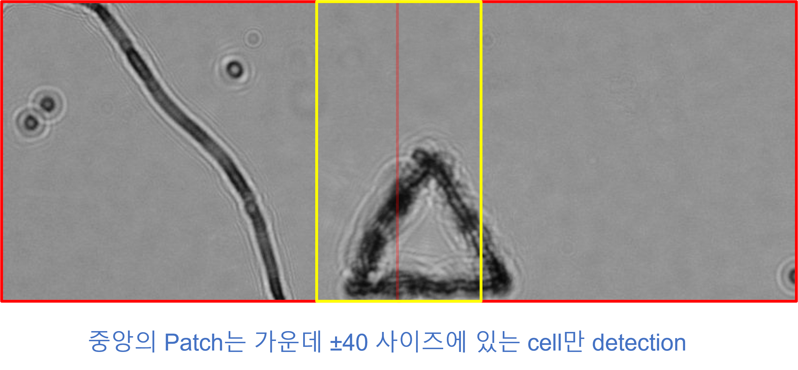
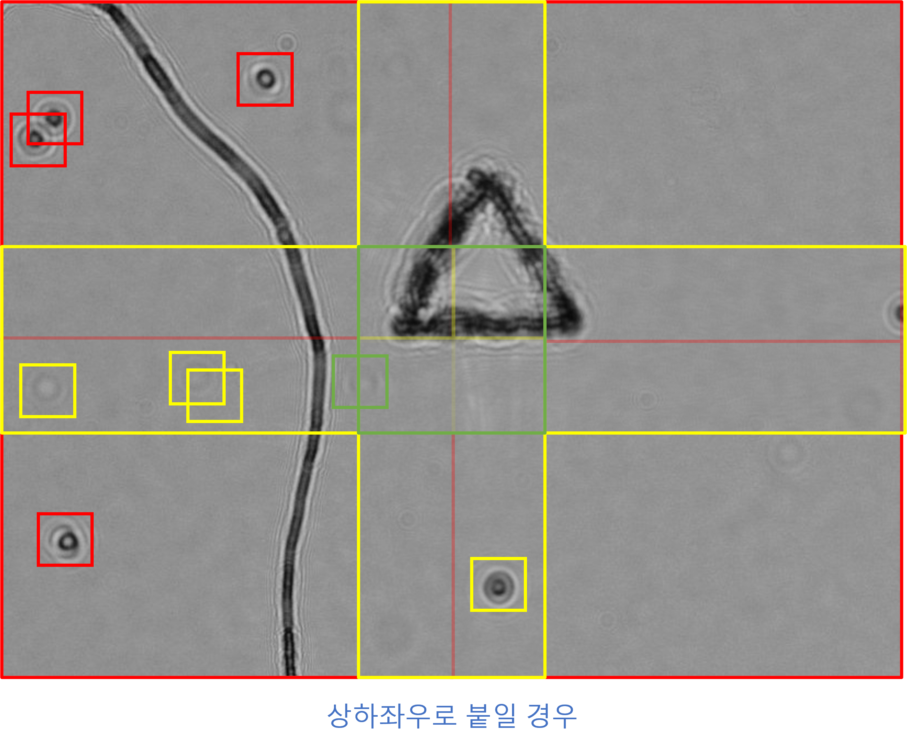
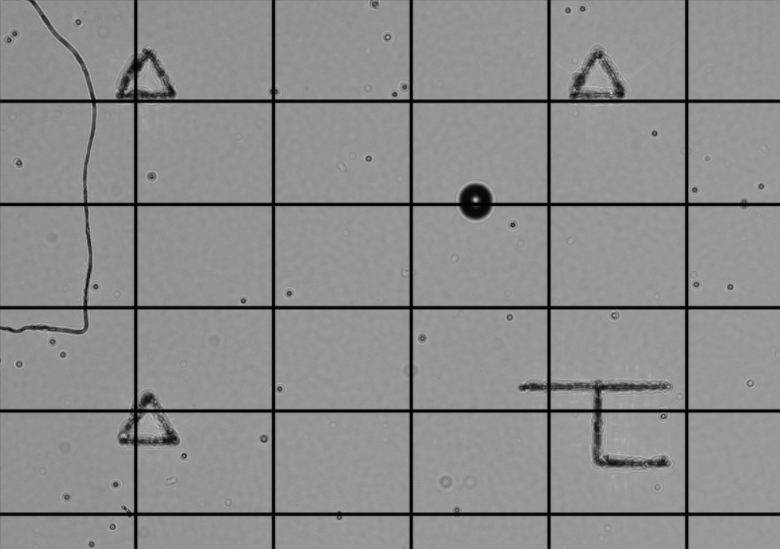
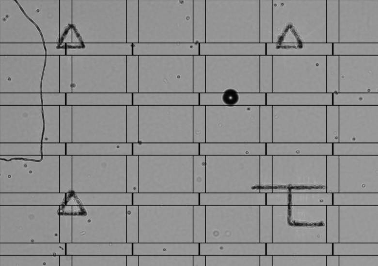
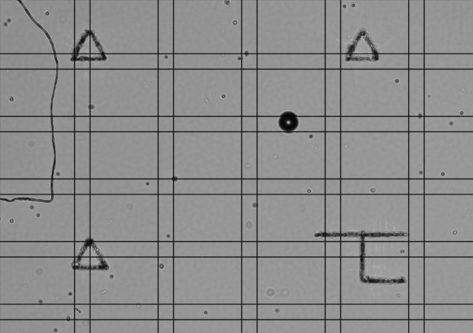

# 04- 패치 수복화 작업
> 22-05-09  

## 개요

패치 기반으로 Detection한 결과를 다시 이어 붙인다.

## Merging patch-based predictions  

이제 패치 기반 예측 값들을 다시 병합하여 원래의 testset처럼 만들어주는 작업이 필요하다.
여기서 각 패치의 가장자리 부분은 성능이 낮을 수 밖에 없고 제대로 Detection이 되지 않을 수도 있다. 따라서 그 부위에 대한 patch를 준비하여 Detection 하는 방식을 사용한다.  

예를 들어 2개의 좌우 패치를 합칠 때 다음과 같이 중앙(+-40)에 대한 patch detection 결과를 넣어서 이어붙일수 있도록 제작했다.  

  

patch가 상하좌우의 4가지 일경우 모이는 모서리에 대한 detection도 한번 더 해줘야 한다. 총 9장의 detection이 필요하다.  

  

merge를 하기 위해서 아래의 4가지 단계를 거칠 계획이다.  

    1. 정상적인 patch를 먼저 합치기
    2. 좌우 중간 patch 덮어쓰기
    3. 상하 중간 patch 덮어쓰기
    4. 상하 좌우 중간 patch 덮어쓰기

또한 crop때 사용하던 코드를 활용해서 merge 코드를 쉽게 제작했다. 여기서 border를 추가해 패치를 구분하기 쉽도록 제작해 봤다.  

```python
    patch = cv2.imread(patch_input + '{}_{}_{}.jpg'.format(name, x, y),cv2.IMREAD_GRAYSCALE)
    patch = cv2.copyMakeBorder(patch, 5, 5, 5, 5, cv2.BORDER_CONSTANT)
    patch = cv2.resize(patch, (408, 306))
```  

### 1. 정상적인 patch를 먼저 합치기  
  

### 2. 좌우 중간 patch 덮어쓰기
  

### 3. 상하 중간 patch 덮어쓰기
  

### 4. 상하 좌우 중간 patch 덮어쓰기 
  

## Merging patch-based predictions - labeling  

위의 과정을 labeling에 대해서 수행해보았다.  
다만 영상에 대한 후처리보다 훨씬 더 복잡했는데, 그전에는 그냥 덮어쓰기만 하면 되었지만, 이번에는 덮어쓰면 같은 라벨값이 여러개 존재할 수 있기 때문에, 겹치는 것을 제거하거나, 각 영역별로 라벨을 뽑아 합치거나 둘중 하나의 방식을 선택해야 했다.  

후자가 더 간편하고 오류도 더 적을 것이라는 생각이 들어 각 구역에 대한 라벨링 값을 합치는 로직을 제작했다.  

현재는 pandas dataframe으로 정리하여 print하는 식으로 구현했지만, Back-end에서 손쉽게 사용할 수 있도록 sh파일로 자동화 하는 로직을 제작하려고 한다.  

