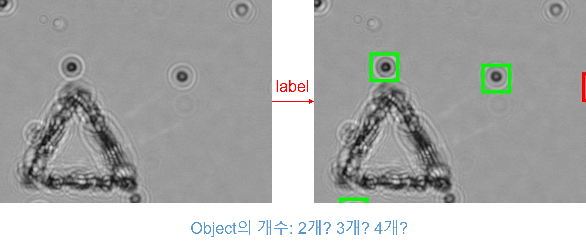

# 01-모델 선정 및 데이터 전처리  
> 22-04-09

## 개요  

Cell Count Object Detection 모델은 가능하면 Swin Transformer를 사용한 모델을 사용해보고  
4k 이미지를 직접 사용하면 정확도가 낮아지고 컴퓨팅 성능에 대한 부담이 생기기 떄문에 Patch data로 쪼개서 사용할 예정이다.  
patch로 인해 잘리게 되는 부분을 생각해 잘리는 중심부에 Detection을 한번 더 수행하고 값을 비교할지에 대해 고민중이다.  

## patch Generation
일단은 학습은 무조건 patch로 진행하는것이 맞다고 생각하여 patch로 자르는 알고리즘을 제작했다.  
가로, 세로 각각 1/8크기로 patch를 만드는데, 이때 stride를 주어 위, 아래로 반씩만 움직이도록 만들었다.  

  

Trainset 8장, validation set 2장, test set 2장 씩 잡았을 때, 학습 데이터를 1800장 확보 할 수 있다.

## patch Labeling
여기서 문제가 되는것이 detection시 x좌표, y좌표에 대해 patch로 자를때 전처리를 해줘야 한다.  
이때 잘리게 되는 특정 Object의 labeling 값을 어떻게 할것인지 생각해보았다. 처음에는 조금이라도 포함되면 labeling 해줄 생각이였는데 다음과 같은 문제에 직면했다.  

  

위같은 경우에는 확실하게 4개라고 하기가 힘들다. 따라서 Object의 중심좌표를 포함하는 것들만 넣어주기로 했다.  
csv 값을 right-left, bottom-top 해보면, 각 Object는 항상 40x40의 bbox인 것을 알수가 있다. 따라서 right-20, bottom-20의 값이 patch안에 포함되어있으면, Object로 인식할 수 있도록 프로그램을 수정했다.  

